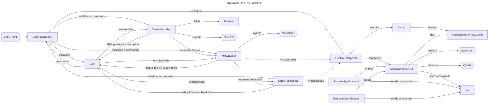

```mermaid
---
title: Kontrollfluss GestureGlide
---
flowchart LR
    EntryPoint(Entry Point) --> EngineController
    EngineController -- initialises --> GUI
    GUI -- commands --> EngineController
    EngineController -- initialises + commands --> CameraHandler
    EngineController -- initialises --> GestureInterpreter
    EngineController -- initialises + commands --> ScrollRecognizer
    EngineController -- initialises + commands --> MPWrapper
    CameraHandler -- fetch --> Camera
    CameraHandler -- debug info via subscription --> GUI
    GUI -- unsubscribes --> CameraHandler
    CameraHandler -- imports --> OpenCV{{OpenCV}}
    CameraHandler -- transmits frames --> MPWrapper
    MPWrapper -- debug info via subscription --> GUI
    GUI -- unsubscribes --> MPWrapper
    ScrollRecognizer -- debug info via subscription --> GUI
    GUI -- unsubscribes --> ScrollRecognizer
    MPWrapper -- transmits landmarks --> ScrollRecognizer
    MPWrapper -- imports --> MediaPipe{{MediaPipe}}
    MPWrapper -. <<Interface>> subscribes .-> GestureInterpreter
    ScrollRecognizer -. <<Interface>> subscribes .-> GestureInterpreter
    GestureInterpreter -- fetches --> Config
    Config -- fetches --> ApplicationShortcutConfig
    GestureInterpreter -- configures --> ApplicationShortcut
    ApplicationShortcut -- has --> ApplicationShortcutConfig
    ApplicationShortcut -- imports --> PyWinAuto{{pywinauto}}
    ApplicationShortcut -- imports --> Quartz{{Quartz}}
    ApplicationShortcut -- sends commands --> OS
    RouletteSpinShortcut -- inherits --> ApplicationShortcut
    RouletteSpinShortcut -- sends commands --> OS
    RouletteOpenShortcut -- inherits --> ApplicationShortcut
    RouletteOpenShortcut -- sends commands --> OS
```